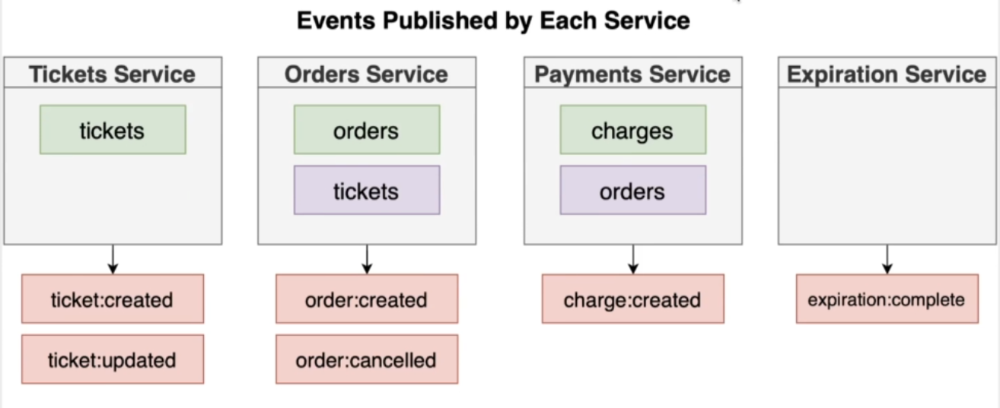

# Bookme

A ticket booking micro-service application

## Tech Stack

- **Server**: ExpressJS
- **Client**: NextJS
- **Database**: MongoDB, Redis
- **Event Streaming**: NATS (Event Bus)
- **Dev-Ops**: Docker, Kubernetes, Skaffold
- **Testing**: Jest

## Design

**Models**

**Services**

**Events**

