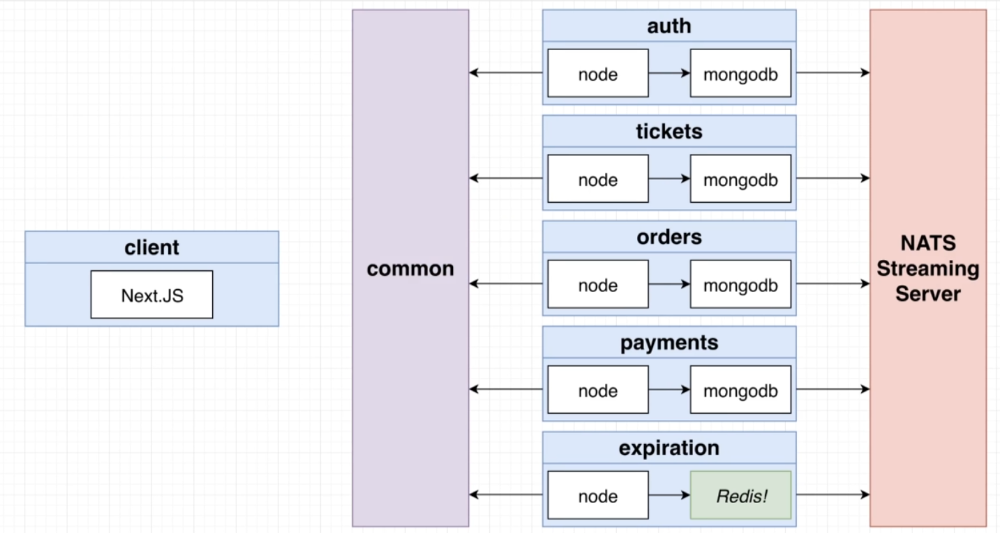

# Bookme

A ticket booking micro-service application

## Tech Stack

- Server: ExpressJS
- Client: NextJS
- Database: MongoDB, Redis
- Event Streaming: NATS (Event Bus)
- Dev Ops: Docker, Kubernetes

## Design

**Resources**(models)

**Services**

**Events**

