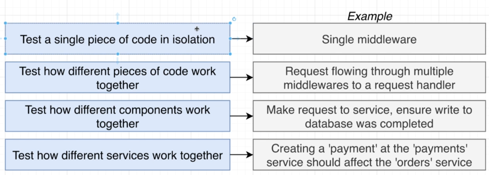
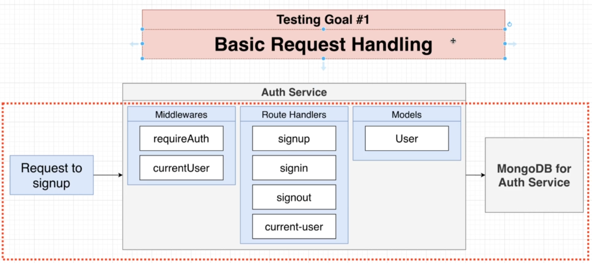
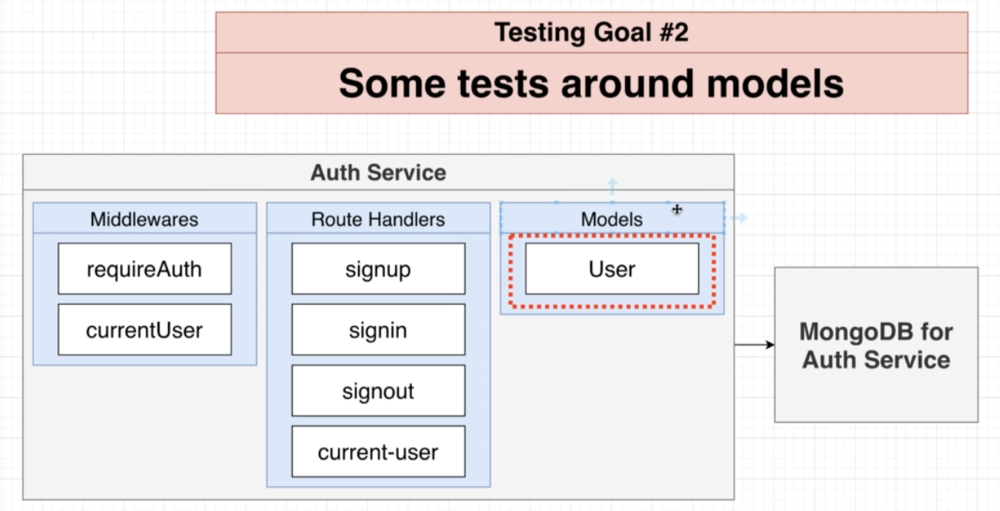
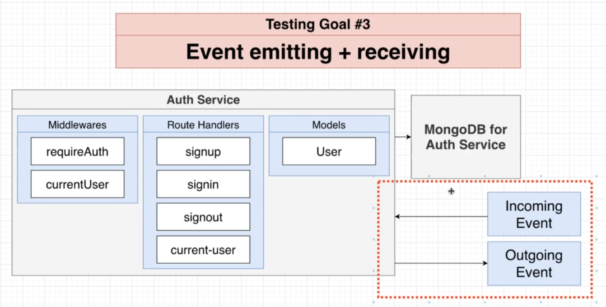
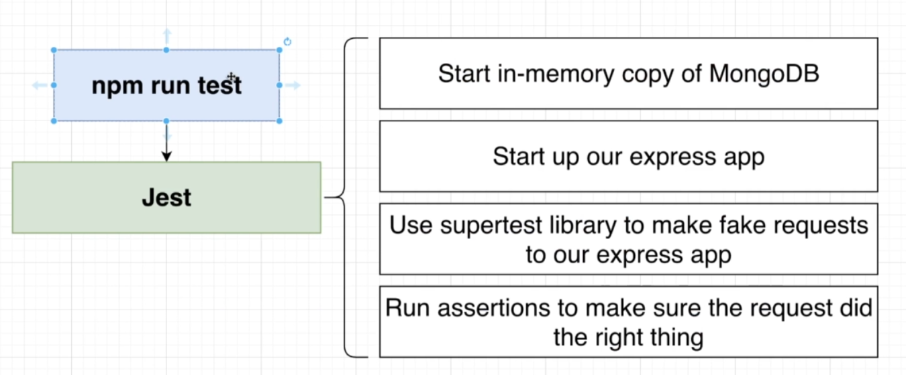

# Testing Isolated Microservices

### Scope of our tests

Libraries: Jest, Supertest

### The types of tests that we will be writing are

- Basic request handling

  
- Some tests around models

- Event emitting + receiving

How are we going to run these tests?

- Directly from our terminal without using Docker

