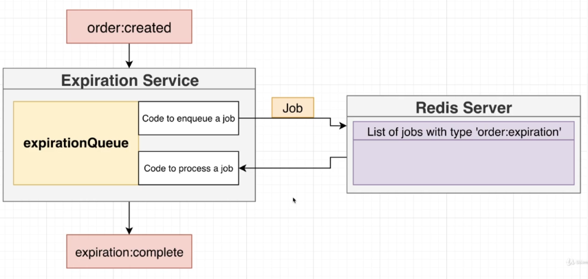

# Expiration Service

## Dependencies

- BullJS
- typescript
- ts-node-dev: Tool to execute our project in a dev environment
- express
- @types/express

### BullJS

Why is BullJS used?

- It's a queue system that allows us to execute tasks in a queue.

### What are we doing with BullJS in this service?

## Commands

- Generate TS Config file: `tsc --init`
