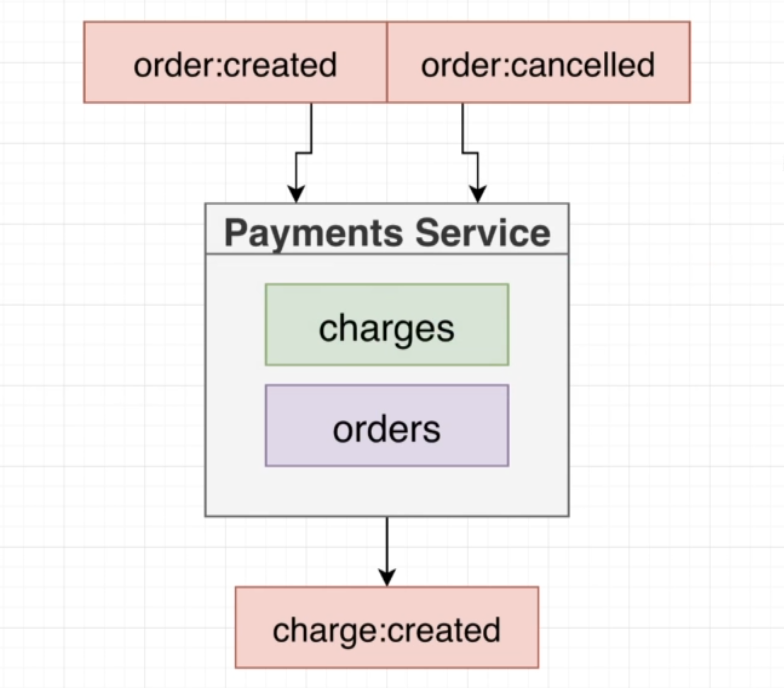

# Payments Service

In this service, we are going to listen to `order:created` and `order:cancelled` events. When these
two events occur, we are going to create a `replicated orders collection` inside the payments service.

## Dependencies

- typescript
- ts-node-dev: Tool to execute our project in a dev environment
- express
- @types/express

## Commands

- Generate TS Config file: `tsc --init`
